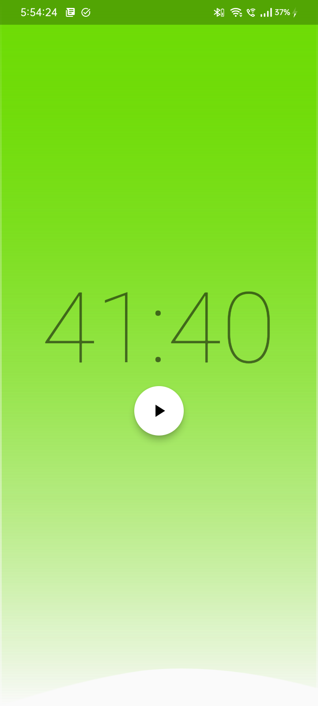
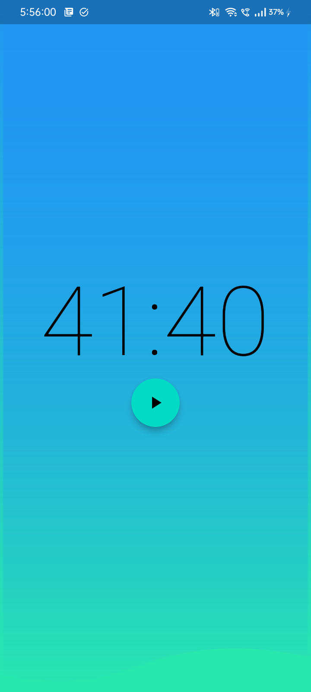
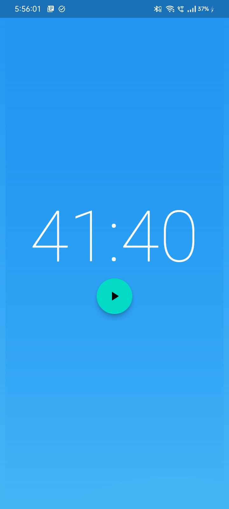
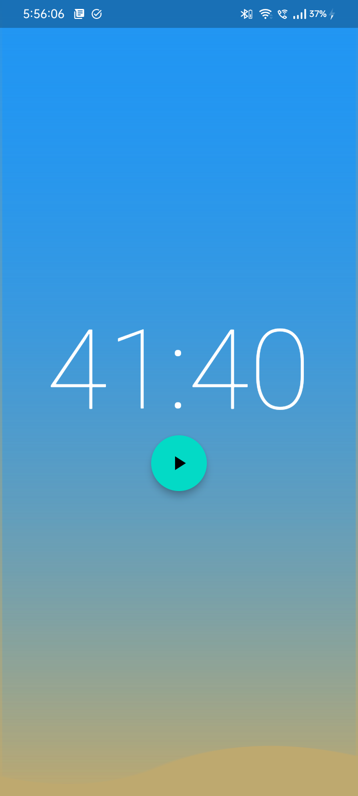
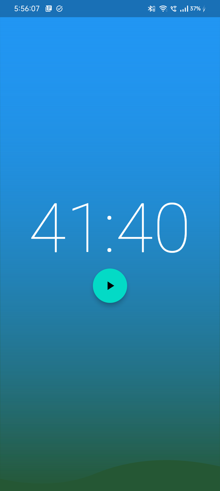
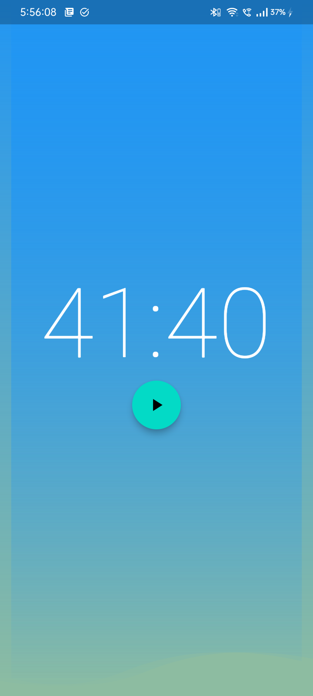
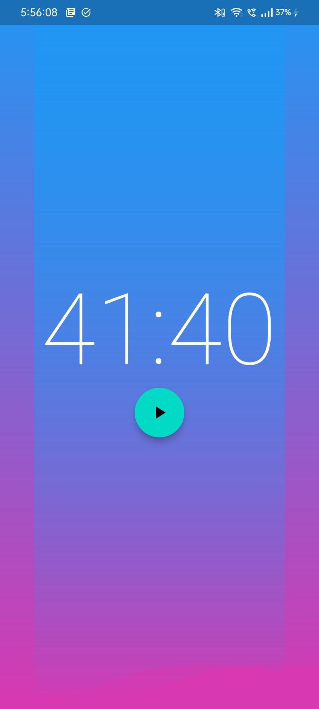

# Timer Application
I made this application just to learn bloc statemanagement in Flutter.

Other than learning bloc state-managment, I also learned how to make paths in Flutter.

I also learned how easy it is to generate a random color in Flutter.

P.S.
```
Color.fromARGB(
      255, Random().nextInt(255), Random().nextInt(255), Random().nextInt(255))
```

That's how I generated a random color.

That's it.

I'm looking forward to add some features to this application.
such as:
- Adding a timer to the application.

Because right now, the application is using a static timer.

Here's some images of the application:

<div style="display: grid; grid-template-columns: repeat(2,minmax(0, 1fr)); gap: 1rem;">
    
    
    
    
    
    
    
</div>